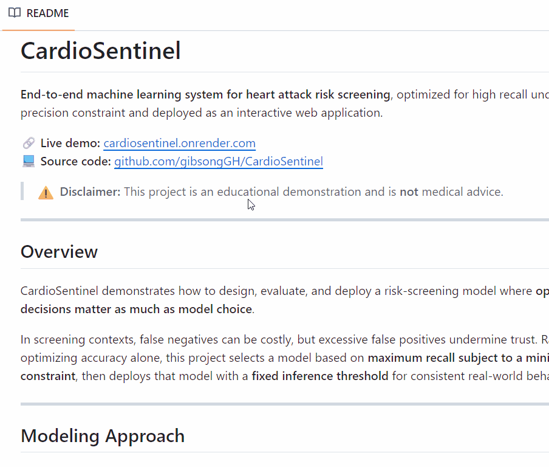

# CardioSentinel

<p align="center">
  
</p>

**End-to-end machine learning system for heart attack risk screening**, optimized for high recall under a fixed precision constraint and deployed as an interactive web application.

🔗 **Live demo:** [cardiosentinel.onrender.com](https://cardiosentinel.onrender.com)  
*First load may take ~1m on free hosting due to cold start*

> ⚠️ **Disclaimer:** This project is an educational demonstration and is **not** medical advice.

---

## Overview

CardioSentinel demonstrates how to design, evaluate, and deploy a risk-screening model where **operating-point decisions matter as much as model choice**.

In screening contexts, false negatives can be costly, but excessive false positives undermine trust. Rather than optimizing accuracy alone, this project selects a model based on **maximum recall subject to a minimum precision constraint**, then deploys that model with a **fixed inference threshold** for consistent real-world behavior.

---

## Modeling Approach

Multiple model families were evaluated:

- Logistic Regression (with and without interaction features)
- Tree-based models (HistGradientBoosting / XGBoost)

Standard metrics (accuracy, ROC-AUC, PR-AUC) were logged, but **model selection was driven by a custom operating-point metric**.

### Key Metric: `recall_at_precision_40`

> *“If we lower the decision threshold until at least 40% of flagged patients are truly at risk (precision ≥ 0.40), what fraction of all actual at-risk patients do we catch?”*

This metric directly encodes the screening trade-off between sensitivity and false positives.

---

## Final Model (Phase 2)

- **Model:** Logistic Regression with interaction features  
- **Selection criterion:** Highest `recall_at_precision_40`  
- **Precision floor:** 0.40  
- **Fixed inference threshold:** `0.3807` (derived during model selection and frozen for inference)  
- **Inference behavior:** Threshold is **fixed** and not recomputed at prediction time  

Model artifacts, evaluation plots, and a machine-readable **model card** are packaged under `artifacts/`.

---

## System Architecture

- Reproducible scikit-learn Pipelines for preprocessing and modeling
- Custom transformers (blood pressure parsing, Bayesian country risk encoding)
- Deterministic stratified 70 / 15 / 15 train / validation / test split
- MLflow experiment tracking for Phase 1 comparisons
- Model card generation for transparency
- Streamlit-based inference UI (Phase 3)
- Dockerized for deployment
- Publicly hosted via Render

---

## Local Execution

Choose one of the following options, then open:
http://localhost:8501

### Run with Streamlit

pip install -r requirements.txt  
streamlit run app/streamlit_app.py  

### Run with Docker

docker build -t cardiosentinel .  
docker run -p 8501:8501 cardiosentinel  

---

## Project Structure
```
artifacts/                  <- final model, model card, evaluation plots  
app/streamlit_app.py        <- Streamlit inference UI  
src/  
  data/load_data.py         <- CSV loader with env-var fallback  
  features/feature_spec.py  <- FeatureSpec + FactoryConfig  
  pipeline/                 <- preprocessing + pipeline assembly  
  eval/evaluation.py        <- metrics, threshold logic, plots  
  train/run_experiments.py  <- Phase 1 experiment runner  
  train/finalize_model.py   <- Phase 2 final model packaging  
  infer/predict.py          <- Phase 3 inference logic  
  utils/                    <- seeding and MLflow helpers  
```
---

## Data

- Source dataset:  
https://www.kaggle.com/datasets/iamsouravbanerjee/heart-attack-prediction-dataset  
(Public, clean educational dataset used for demonstration purposes)

Place heart.csv in data/, or set:  
export DATASET_PATH=/abs/path/to/heart.csv

- Data quality note:
The dataset appears to be synthetic or heavily simplified, with an unrealistically high positive rate and clean feature distributions. The project focuses on modeling, evaluation, threshold selection, and deployment mechanics rather than clinical realism.

---

## Reproducibility

- Fixed random seed: SEED = 42
- Stratified 70 / 15 / 15 train / validation / test split
- Split configuration and seed logged to MLflow for every experiment
- Dependency versions pinned in requirements.txt

---

## Limitations & Ethics

- Educational demonstration only; not medical advice
- Performance depends on threshold choice
- Risk scores are not calibrated probabilities
- Trained on a single dataset
- False positives may cause unnecessary concern
- False negatives may miss at-risk individuals

---

## Development Note (AI-assisted)

Portions of this project were developed with the assistance of AI coding agents under tightly scoped prompts. Architectural decisions, metric definitions, model selection criteria, and deployment strategy were designed and validated manually. All generated code was reviewed, modified, and integrated by the author.


